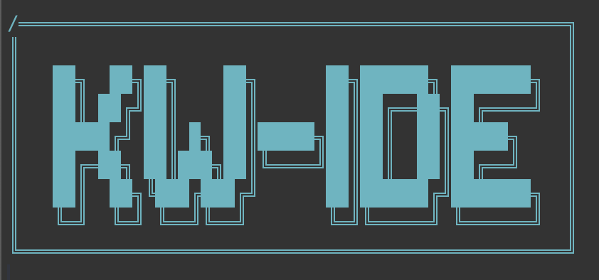

A streamlined, modern Neovim IDE setup optimized for TypeScript, Vue, C/C++, and general development work.

## Getting Started

### Installing Neovim with Bob (Version Manager)

[Bob](https://github.com/MordechaiHadad/bob) is a cross-platform Neovim version manager that makes it easy to install and switch between different Neovim versions.

#### Install Bob

**macOS/Linux:**
```bash
# Using Homebrew (macOS/Linux)
brew install bob

# Or using Cargo (Rust package manager)
cargo install bob-nvim
```

**Windows:**
```powershell
# Using Scoop
scoop install bob

# Or using Cargo
cargo install bob-nvim
```

#### Install Neovim with Bob

```bash
# Install the latest stable version
bob install stable

# Or install a specific version
bob install 0.11.0

# Set the installed version as default
bob use stable
```

#### Verify Installation

```bash
nvim --version
# Should show Neovim v0.11.0 or later
```

### Installing This Configuration

1. **Backup existing config** (if you have one):
   ```bash
   mv ~/.config/nvim ~/.config/nvim.backup
   ```

2. **Clone this repository**:
   ```bash
   git clone https://github.com/apeoverflow/KW-IDE ~/.config/nvim
   ```

3. **Install required tools**:
   ```bash
   # Node.js (for TypeScript/Vue LSPs)
   # macOS:
   brew install node
   
   # ripgrep (for better search)
   brew install ripgrep
   
   # Install language servers globally
   npm install -g @vue/language-server typescript typescript-language-server
   ```

4. **Launch Neovim**:
   ```bash
   nvim
   ```
   
   On first launch:
   - Lazy.nvim will automatically install all plugins
   - TreeSitter parsers will be installed automatically
   - The start page will appear once everything is loaded

5. **Install additional LSP servers** (optional):
   - Press `<Space>` then type and run `:Mason`
   - Select and install servers for your languages (e.g., `clangd`, `pyright`)

### Quick Start After Installation

1. **Open a file**: `nvim myfile.ts`
2. **Toggle file explorer**: Press `Ctrl+B`
3. **Search files**: Press `<Space>sf`
4. **Open terminal**: Press `Ctrl+N`

See the [Quick Reference Card](#quick-reference-card) below for more keybindings.

## Features Overview

### Core Capabilities
- **Smart File Navigation** - Jump to files and definitions across languages
- **Integrated Terminal** - Built-in terminal with quick access
- **Multi-Language LSP Support** - TypeScript, Vue, C/C++, Lua
- **File Explorer** - Tree-style file browser
- **Fuzzy Finding** - Fast file and text search
- **Code Outline** - Symbol/function overview panel
- **Git Integration** - Git operations and diff viewing
- **AI Assistance** - GitHub Copilot integration
- **Custom Start Page** - Quick access to recent files and shortcuts

---

## Quick Reference Card

### Essential Keybindings

| Key | Mode | Action |
|-----|------|--------|
| `<Space>` | - | **Leader Key** |
| `Ctrl+S` | Normal/Insert | Save file |
| `Ctrl+N` | Normal | Open terminal (horizontal split) |
| `Ctrl+X` | Terminal | Exit terminal to normal mode |
| `Ctrl+B` | Normal | Toggle file explorer |
| `Space+Ctrl+B` | Normal | Find current file in explorer |
| `gf` | Normal | Go to file under cursor |
| `Y` | Visual | Copy selection to clipboard |

### Navigation
| Key | Mode | Action |
|-----|------|--------|
| `Alt+H/J/K/L` | Normal/Terminal | Move between windows |
| `Option+H/J/K/L` | Normal/Terminal | Move between windows (macOS) |
| `Ctrl+D` | Normal | Half page down (centered) |
| `Ctrl+U` | Normal | Half page up (centered) |
| `j/k` | Normal | Move down/up (handles wrapped lines) |

### File Operations
| Key | Mode | Action |
|-----|------|--------|
| `<Space>sf` | Normal | **Search Files** |
| `<Space>ff` | Normal | **Find Git Files** |
| `<Space>sg` | Normal | **Search in Files (Grep)** |
| `<Space>o` | Normal | **Toggle Outline Panel** |
| `<Space>lg` | Normal | **Open LazyGit** |
| `<Space>x` | Normal | **Split Buffer Horizontally** |
| `<Space>v` | Normal | **Split Buffer Vertically** |
| `gf` | Normal | Go to file/definition under cursor |

### LSP & Development
| Key | Mode | Action |
|-----|------|--------|
| `gd` | Normal | Go to definition |
| `K` | Normal | Show hover documentation |
| `<Leader>rn` | Normal | Rename symbol |
| `<Leader>ca` | Normal | Code actions |
| `<Leader>li` | Normal | **LSP debug info** |
| `<Leader>lc` | Normal | **Manually start clangd** |

---

## Language-Specific Features

### TypeScript/JavaScript/Vue
- **Auto-completion** with IntelliSense
- **Import resolution** - `gf` works with `@/` aliases
- **Vue Language Server** - Full Vue.js support
- **Error highlighting** and diagnostics

### C/C++
- **Clangd integration** - Auto-starts for `.c/.cpp` files
- **System headers** - `gf` on `<stdio.h>` works
- **Clang-tidy** integration for code quality
- **Background indexing** for large projects

### General
- **Syntax highlighting** via TreeSitter
- **Auto-indentation** and formatting
- **Git integration** with LazyGit
- **GitHub Copilot** suggestions

---

## Detailed Feature Guide

### File Explorer (`Ctrl+B`)
- **Toggle** file tree on left side (`Ctrl+B`)
- **Find current file** in explorer (`Space+Ctrl+B`)
- **Navigate** with arrow keys or `hjkl`
- **Open** files with `Enter`
- **Create** files/folders with `a`
- **Delete** with `d`
- **Rename** with `r`

### Fuzzy Finding
#### Search Files (`<Space>sf`)
- Search all files in project
- Type to filter results
- `Enter` to open, `Ctrl+C` to cancel

#### Search in Files (`<Space>sg`)
- Live grep across all files
- Search content, not just filenames
- Real-time results as you type

### Terminal Integration (`Ctrl+N`)
- Opens **horizontal split** with 10 lines
- Uses `zsh` shell
- **Exit** terminal mode with `Ctrl+X`
- **Navigate** between terminal and editor with `Alt+HJKL`

### Smart File Navigation (`gf`)
Intelligently handles different file types:

#### TypeScript/Vue Projects
- `@/models/User` → `src/models/User.ts`
- `./components/Button` → `./components/Button.vue`
- `/utils/helpers` → `src/utils/helpers.js`

#### C/C++ Projects
- `<stdio.h>` → System header location
- `"myheader.h"` → Local header file
- Uses LSP for accurate navigation

### Code Outline (`<Space>o`)
- **Symbol browser** for current file
- Shows **functions, classes, variables**
- **Quick navigation** to symbols
- **Automatically updates** as you edit

### Buffer Management
- **Buffer splits** - Duplicate current buffer in new panes (`<Space>x`, `<Space>v`)
- **Window navigation** - Move between panes with `Alt+HJKL`
- **Seamless workflow** - Keep same file open in multiple views

### Git Integration
- **File status** indicators in explorer
- **LazyGit** floating window for git operations (`<Space>lg`)
  - Opens in 85% scaled floating window with rounded corners
  - Full git interface with staging, committing, and branching
  - Closes cleanly when exiting LazyGit
- **Diff highlighting** in editor
- **Git blame** and history

---

## Code Organization

### Directory Structure
```
~/.config/nvim/
├── init.lua                 # Main configuration entry point
├── lazy-lock.json          # Plugin version lockfile
├── lua/
│   ├── config/             # Configuration modules (unused in current setup)
│   └── plugins/            # Plugin configurations
│       ├── colorscheme.lua # OneDark theme
│       ├── completion.lua  # nvim-cmp autocompletion
│       ├── copilot.lua     # GitHub Copilot
│       ├── git.lua         # LazyGit integration (floating window)
│       ├── lsp.lua         # Language servers (modern vim.lsp.config)
│       ├── nvim-tree.lua   # File explorer
│       ├── startpage.lua   # Custom start screen
│       ├── telescope.lua   # Fuzzy finder
│       ├── treesitter.lua  # Syntax highlighting
│       └── ui.lua          # Status line, git signs, outline
└── README.md               # This file
```

### Configuration Architecture

#### Monolithic `init.lua`
The configuration uses a **streamlined approach** with most settings in the main `init.lua` file:

**Core Settings (Lines 1-30)**
- Leader keys, basic options, file navigation settings

**Custom Functions (Lines 32-84)**
- Smart `gf` implementation with alias support
- Handles `@/` aliases, C headers, relative paths
- Buffer split functions for horizontal/vertical duplication

**Keymaps (Lines 74-167)**
- All essential keybindings defined early
- Terminal, navigation, and utility mappings

**Plugin Management (Lines 169-195)**
- Lazy.nvim bootstrap and setup
- Imports plugin configurations from `lua/plugins/`

**LSP Auto-start (Lines 197-218)**
- FileType autocmds for automatic LSP launching
- clangd for C/C++, volar for Vue

**Deferred Plugin Keymaps (Lines 220-250)**
- Plugin-dependent keybindings loaded after startup
- Telescope, nvim-tree, outline integration

#### Plugin Modules (`lua/plugins/`)
Each plugin has its own configuration file for maintainability:

- **Self-contained** - Each file configures one plugin or related group
- **Lazy-loaded** - Plugins load only when needed
- **Minimal dependencies** - Reduced startup time

### Key Design Principles

1. **Performance First** - Essential features load immediately, extras are deferred
2. **Graceful Degradation** - Keybindings work even if plugins fail to load
3. **Language Awareness** - Different behavior for different file types
4. **Minimal Complexity** - Avoid over-abstraction, keep it readable

---

## Troubleshooting

### Common Issues

**LSP Not Working**
- Run `<Leader>li` to check LSP status
- Manually start with `<Leader>lc` (C/C++)
- Check `:LspInfo` for detailed information

**File Navigation Issues**
- Ensure file extensions are correct
- Check if `@` alias points to `src/` directory
- Try `:set path?` to see search paths

**Plugin Loading Problems**
- Run `:Lazy` to check plugin status
- Use `:Lazy sync` to update plugins
- Check for error messages in `:messages`

**Terminal Not Opening**
- Verify zsh is installed and in PATH
- Try manual command: `:split term://zsh`

---

## Customization

### Adding New Languages
1. Install LSP server via `:Mason`
2. Add FileType autocmd in `init.lua`:
```lua
vim.api.nvim_create_autocmd('FileType', {
  pattern = { 'python' },
  callback = function()
    vim.lsp.start({
      name = 'pyright',
      cmd = { 'pyright-langserver', '--stdio' },
      root_dir = vim.fn.getcwd(),
    })
  end,
})
```

### Custom Keybindings
Add to the keymaps section in `init.lua`:
```lua
map('n', '<leader>custom', ':echo "Hello!"<CR>', { desc = 'Custom command' })
```

### Plugin Configuration
Create new files in `lua/plugins/` or modify existing ones. The setup automatically imports all plugin files.

---

## Installation Notes

### Requirements
- **Neovim 0.11+** (uses modern LSP APIs)
- **Git** (for plugin management)
- **Mason** (for LSP server installation)
- **Node.js** (for TypeScript/Vue language servers)
- **clangd** (for C/C++ support)

### External Dependencies
- **telescope-fzf-native** requires `make`
- **TreeSitter** parsers auto-install
- **ripgrep** recommended for better grep performance

