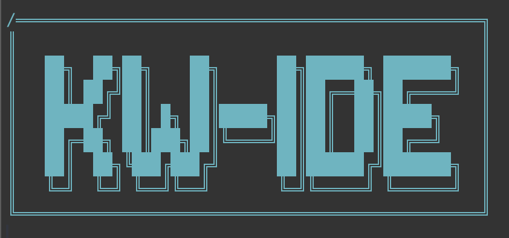

A streamlined, modern Neovim IDE setup optimized for TypeScript, Vue, C/C++, Dart/Flutter, and general development work.

## Getting Started

### Installing Neovim with Bob (Version Manager)

[Bob](https://github.com/MordechaiHadad/bob) is a cross-platform Neovim version manager that makes it easy to install and switch between different Neovim versions.

#### Install Bob

**macOS/Linux:**
```bash
# Using Homebrew (macOS/Linux)
brew install bob

# Or using Cargo (Rust package manager)
cargo install bob-nvim
```

**Windows:**
```powershell
# Using Scoop
scoop install bob

# Or using Cargo
cargo install bob-nvim
```

#### Install Neovim with Bob

```bash
# Install the latest stable version
bob install stable

# Or install a specific version
bob install 0.11.0

# Set the installed version as default
bob use stable
```

#### Verify Installation

```bash
nvim --version
# Should show Neovim v0.11.0 or later
```

### Installing This Configuration

1. **Backup existing config** (if you have one):
   ```bash
   mv ~/.config/nvim ~/.config/nvim.backup
   ```

2. **Clone this repository**:
   ```bash
   git clone https://github.com/apeoverflow/KW-IDE ~/.config/nvim
   ```

3. **Install required tools**:
   ```bash
   # Node.js (for TypeScript/Vue LSPs)
   # macOS:
   brew install node
   
   # ripgrep (for better search)
   brew install ripgrep
   
   # Install language servers globally
   npm install -g @vue/language-server typescript typescript-language-server
   ```

4. **Launch Neovim**:
   ```bash
   nvim
   ```
   
   On first launch:
   - Lazy.nvim will automatically install all plugins
   - TreeSitter parsers will be installed automatically
   - The start page will appear once everything is loaded

5. **Install additional LSP servers** (optional):
   - Press `<Space>` then type and run `:Mason`
   - Select and install servers for your languages (e.g., `clangd`, `pyright`)

### Quick Start After Installation

1. **Open a file**: `nvim myfile.ts`
2. **Toggle file explorer**: Press `Ctrl+B`
3. **Search files**: Press `<Space>sf`
4. **Open terminal**: Press `Ctrl+N`

See the [Quick Reference Card](#quick-reference-card) below for more keybindings.

## Features Overview

### Core Capabilities
- **Smart File Navigation** - Jump to files and definitions across languages
- **Integrated Terminal** - Built-in terminal with quick access
- **Multi-Language LSP Support** - TypeScript, Vue, C/C++, Dart/Flutter, Lua
- **File Explorer** - Tree-style file browser
- **Fuzzy Finding** - Fast file and text search
- **Code Outline** - Symbol/function overview panel
- **Git Integration** - Git operations and diff viewing
- **AI Assistance** - GitHub Copilot integration
- **Custom Start Page** - Quick access to recent files and shortcuts

---

## Quick Reference Card

### Essential Keybindings

| Key | Mode | Action |
|-----|------|--------|
| `<Space>` | - | **Leader Key** |
| `Ctrl+S` | Normal/Insert | Save file |
| `Ctrl+N` | Normal | Open terminal (horizontal split) |
| `Ctrl+X` | Terminal | Exit terminal to normal mode |
| `Ctrl+C` | Terminal | Close terminal |
| `Ctrl+B` | Normal | Toggle file explorer |
| `Space+Ctrl+B` | Normal | Find current file in explorer |
| `gf` | Normal | Go to file under cursor |
| `Y` | Normal | Yank to end of line |
| `Y` | Visual | Copy selection to clipboard |
| `<Space>h` | Normal | Clear search highlight |
| `<C-a>` | Normal | Previous tab |
| `<A-3>` | Insert | Insert `#` character (macOS) |

### Navigation
| Key | Mode | Action |
|-----|------|--------|
| `Alt+H/J/K/L` | Normal/Terminal | Move between windows |
| `Option+H/J/K/L` | Normal/Terminal | Move between windows (macOS) |
| `Ctrl+D` | Normal | Half page down (centered) |
| `Ctrl+U` | Normal | Half page up (centered) |
| `j/k` | Normal | Move down/up (handles wrapped lines) |

### File Operations
| Key | Mode | Action |
|-----|------|--------|
| `<Space>sf` | Normal | **Search Files** |
| `<Space>ff` | Normal | **Find Git Files** |
| `<Space>sg` | Normal | **Search in Files (Grep)** |
| `<Space>o` | Normal | **Toggle Outline Panel** |
| `<Space>lg` | Normal | **Open LazyGit** |
| `<Space>x` | Normal | **Split Buffer Horizontally** |
| `<Space>v` | Normal | **Split Buffer Vertically** |
| `gf` | Normal | Go to file/definition under cursor |
| `<Space>cd` | Normal | **Copy working directory to clipboard** |
| `<Space>mm` | Normal | **Mark current file and line** |
| `<Space>mj` | Normal | **Jump to marked file and line** |
| `<Space>mc` | Normal | **Mark position and copy nvim command** |

### LSP & Development
| Key | Mode | Action |
|-----|------|--------|
| `gd` | Normal | Go to definition |
| `K` | Normal | Show hover documentation |
| `<Leader>rn` | Normal | Rename symbol |
| `<Leader>ca` | Normal | Code actions |
| `<Leader>li` | Normal | **LSP debug info** |
| `<Leader>lc` | Normal | **Manually start clangd** |

---

## Language-Specific Features

### TypeScript/JavaScript/Vue
- **Auto-completion** with IntelliSense
- **Import resolution** - `gf` works with `@/` aliases
- **Vue Language Server** - Full Vue.js support
- **Error highlighting** and diagnostics

### C/C++
- **Full IDE Experience** - Complete C/C++ development environment
- **Clangd integration** - Auto-starts with enhanced configuration
- **CMake integration** - Build, run, and debug CMake projects
- **Clangd Extensions** - Inlay hints, AST viewer, type hierarchy
- **DAP Debugging** - Full debugger with breakpoints and variable inspection
- **Header/Source switching** - Quick navigation between `.h` and `.cpp` files
- **Auto-formatting** - Format on save with clang-format
- **Man page lookup** - `<Leader>cm` opens man page for word under cursor

### Dart/Flutter (FVM Support)
- **FVM Integration** - Automatic detection and usage of FVM Flutter versions
- **Dart LSP** - Full language server with FVM-managed Dart SDK
- **Flutter Tools** - Hot reload, debugging, device management
- **Smart Commands** - Auto-detects FVM projects vs global Flutter
- **Debugging Support** - DAP integration with breakpoints and variable inspection

### Rust
- **Full IDE Experience** - Complete Rust development environment
- **rust-analyzer** - Advanced LSP with inlay hints, clippy integration
- **Cargo integration** - Build, run, test, clippy, fmt commands
- **Crates.nvim** - Manage dependencies in Cargo.toml
- **DAP Debugging** - Full debugger with breakpoints and variable inspection
- **Macro expansion** - View expanded macros inline
- **Documentation** - Open docs.rs for any symbol

### Go
- **Full IDE Experience** - Complete Go development environment
- **gopls integration** - Advanced LSP with inlay hints, staticcheck
- **Go tools** - Build, run, test, vet, lint, generate
- **go.nvim** - Enhanced Go development with code actions
- **DAP Debugging** - Full debugger with delve integration
- **Test generation** - Auto-generate test functions
- **Struct tags** - Add/remove JSON, XML, and other struct tags

### General
- **Syntax highlighting** via TreeSitter
- **Auto-indentation** and formatting
- **Git integration** with LazyGit
- **GitHub Copilot** suggestions

### GitHub Copilot
AI-powered code suggestions with manual trigger mode for non-intrusive assistance.

#### Inline Suggestions (Insert Mode)
| Key | Action |
|-----|--------|
| `<M-l>` (Alt+L) | Accept suggestion |
| `<M-]>` (Alt+]) | Next suggestion |
| `<M-[>` (Alt+[) | Previous suggestion |
| `<C-]>` (Ctrl+]) | Dismiss suggestion |

#### Copilot Panel
| Key | Mode | Action |
|-----|------|--------|
| `<C-g>` | Insert | Open panel |
| `<M-CR>` (Alt+Enter) | Insert | Toggle panel |
| `[[` | Panel | Previous suggestion |
| `]]` | Panel | Next suggestion |
| `<CR>` | Panel | Accept suggestion |
| `gr` | Panel | Refresh suggestions |

#### Commands
- `:Copilot` - Check status/enable
- `:Copilot status` - Authentication status
- `:Copilot auth` - Authenticate with GitHub

#### Disabled Filetypes
Copilot is disabled for: yaml, markdown, help, gitcommit, gitrebase

---

## Dart/Flutter Development Setup

### Prerequisites
1. **Install Flutter & Dart**:
   ```bash
   # Install Flutter (follow official instructions)
   # https://docs.flutter.dev/get-started/install

   # Or use FVM for Flutter version management (recommended)
   dart pub global activate fvm
   ```

2. **FVM Setup** (Recommended):
   ```bash
   # Install FVM globally
   dart pub global activate fvm

   # In your Flutter project
   fvm install stable
   fvm use stable
   ```

### Features

#### Automatic FVM Detection
The configuration automatically detects and uses FVM when available:
- ✅ Detects `.fvmrc` or `.fvm/fvm_config.json` files
- ✅ Uses `fvm flutter` commands in FVM projects
- ✅ Falls back to global Flutter in non-FVM projects
- ✅ Dart LSP uses correct FVM Flutter/Dart version

#### Flutter Commands
| Command | Description |
|---------|-------------|
| `:FlutterDoctor` | Run flutter doctor (FVM-aware) |
| `:FlutterPubGet` | Run flutter pub get |
| `:FlutterPubUpgrade` | Run flutter pub upgrade |
| `:FlutterClean` | Run flutter clean |

#### Key Bindings
| Key | Mode | Action |
|-----|------|--------|
| `<Space>li` | Normal | **LSP info** (shows FVM status) |
| `<Leader>fr` | Normal | **Flutter run** (FVM-aware) |
| `<Leader>fh` | Normal | **Flutter hot reload** |
| `<Leader>fR` | Normal | **Flutter restart** |
| `<Leader>fd` | Normal | **Flutter devices** |
| `<Leader>fe` | Normal | **Flutter emulators** |
| `<Leader>fo` | Normal | **Flutter outline toggle** |
| `<Leader>fp` | Normal | **Open pubspec.yaml** |
| `<Leader>fm` | Normal | **Open lib/main.dart** |
| `<F5>` | Normal | **Start/Continue debugging** |
| `<F1>` | Normal | **Debug step into** |
| `<F2>` | Normal | **Debug step over** |
| `<F3>` | Normal | **Debug step out** |
| `<Leader>b` | Normal | **Toggle breakpoint** |

#### Terminal Integration
- `<Leader>fr` - Opens Flutter run terminal (auto-detects FVM)
- `<Leader>ft` - Opens Flutter test terminal (auto-detects FVM)
- Terminals use appropriate Flutter version (FVM or global)

#### Testing Your Setup
1. **Open a Flutter project**:
   ```bash
   cd your-flutter-project
   nvim lib/main.dart
   ```

2. **Check LSP status**: Press `<Space>li`
   - Should show Dart LSP connected
   - Should display FVM version if using FVM
   - Should show correct Dart SDK version

3. **Test Flutter commands**: Try `:FlutterDoctor`
   - Should run quickly and close (means no issues)
   - Uses FVM automatically in FVM projects

#### Debugging Setup
- **DAP Integration** - Full debugging support with `nvim-dap`
- **Breakpoints** - Set with `<Leader>b`, visual indicators in gutter
- **Variable Inspection** - Hover over variables during debugging
- **Step Debugging** - Use F1/F2/F3 for step into/over/out
- **Debug UI** - Automatic debug panel with variables, call stack, etc.

---

## C/C++ Development Setup

A complete IDE experience for C and C++ development with clangd, CMake integration, debugging support, and powerful code navigation.

### Prerequisites

1. **Install clangd** (Language Server):
   ```bash
   # macOS (included with Xcode Command Line Tools)
   xcode-select --install

   # Or install LLVM for latest clangd
   brew install llvm
   ```

2. **Install CMake** (Build System):
   ```bash
   brew install cmake ninja
   ```

3. **Install CodeLLDB** (Debugger - via Mason):
   ```vim
   :Mason
   " Search for 'codelldb' and install it
   ```

### Features

#### Enhanced Clangd Configuration
The clangd LSP is configured with optimal settings:
- **Background indexing** - Index your project for fast navigation
- **Clang-tidy** - Integrated static analysis and linting
- **Header insertion** - Auto-add includes when needed (IWYU style)
- **Detailed completions** - Rich completion with function signatures
- **Inlay hints** - Parameter and type hints inline
- **4 parallel jobs** - Fast indexing on multi-core systems

#### Build System Auto-Detection
The configuration automatically detects your build system:
- **CMake** - `CMakeLists.txt`
- **Make** - `Makefile` or `makefile`
- **Meson** - `meson.build`
- **Bazel** - `BUILD` or `BUILD.bazel`

#### C/C++ Commands
| Command | Description |
|---------|-------------|
| `:CppBuild` | Build project (auto-detects build system) |
| `:CppRun` | Run project executable |
| `:CppClean` | Clean build artifacts |
| `:CppGenerateCompileCommands` | Generate `compile_commands.json` |
| `:CppInfo` | Show C/C++ development info and tool status |
| `:CppSwitchHeaderSource` | Switch between header and source file |
| `:CppNewClass ClassName` | Create new C++ class (header + source) |
| `:CppShowAST` | Show AST for current file |
| `:CppTypeHierarchy` | Show type hierarchy |
| `:CppSymbolInfo` | Show symbol information |
| `:CppMemoryUsage` | Show clangd memory usage |

#### CMake Commands (in CMake projects)
| Command | Description |
|---------|-------------|
| `:CMakeGenerate` | Configure CMake project |
| `:CMakeBuild` | Build with CMake |
| `:CMakeRun` | Run CMake target |
| `:CMakeDebug` | Debug CMake target |
| `:CMakeSelectBuildType` | Select Debug/Release/etc. |
| `:CMakeSelectLaunchTarget` | Select executable target |

#### Key Bindings (C/C++ files only)
| Key | Mode | Action |
|-----|------|--------|
| `<Leader>cb` | Normal | **Build project** |
| `<Leader>cr` | Normal | **Run project** |
| `<Leader>cc` | Normal | **Clean build** |
| `<Leader>cg` | Normal | **Generate compile_commands.json** |
| `<Leader>ch` | Normal | **Switch header/source** |
| `<A-o>` | Normal | **Switch header/source** (Alt+O) |
| `<Leader>ct` | Normal | **Show type hierarchy** |
| `<Leader>cs` | Normal | **Show symbol info** |
| `<Leader>ci` | Normal | **C++ dev info** |
| `<Leader>cf` | Normal | **Compile current file only** |
| `<Leader>cx` | Normal | **Run compiled file** |

#### CMake Key Bindings (in CMake projects)
| Key | Mode | Action |
|-----|------|--------|
| `<Leader>cmc` | Normal | **CMake configure** |
| `<Leader>cmb` | Normal | **CMake build** |
| `<Leader>cmr` | Normal | **CMake run** |
| `<Leader>cmd` | Normal | **CMake debug** |
| `<Leader>cms` | Normal | **Select build type** |
| `<Leader>cmt` | Normal | **Select target** |

#### Debugging Key Bindings
| Key | Mode | Action |
|-----|------|--------|
| `<F5>` | Normal | **Start/Continue debugging** |
| `<F9>` | Normal | **Toggle breakpoint** |
| `<F10>` | Normal | **Terminate debugging** |
| `<F1>` | Normal | **Step into** |
| `<F2>` | Normal | **Step over** |
| `<F3>` | Normal | **Step out** |
| `<F4>` | Normal | **Run to cursor** |
| `<F6>` | Normal | **Pause** |
| `<Leader>b` | Normal | **Toggle breakpoint** |
| `<Leader>B` | Normal | **Conditional breakpoint** |
| `<Leader>lp` | Normal | **Log point** |
| `<Leader>dr` | Normal | **Open debug REPL** |
| `<Leader>dl` | Normal | **Run last debug config** |
| `<Leader>du` | Normal | **Toggle debug UI** |
| `<Leader>de` | Normal/Visual | **Evaluate expression** |

### Quick Start

1. **Create a CMake project**:
   ```bash
   mkdir myproject && cd myproject
   ```

2. **Create CMakeLists.txt**:
   ```cmake
   cmake_minimum_required(VERSION 3.16)
   project(myproject LANGUAGES CXX)
   set(CMAKE_CXX_STANDARD 17)
   set(CMAKE_EXPORT_COMPILE_COMMANDS ON)
   add_executable(myproject main.cpp)
   ```

3. **Create main.cpp**:
   ```cpp
   #include <iostream>
   int main() {
       std::cout << "Hello, World!" << std::endl;
       return 0;
   }
   ```

4. **Open in Neovim**:
   ```bash
   nvim main.cpp
   ```

5. **Build and run**:
   - Press `<Leader>cb` to build
   - Press `<Leader>cr` to run

6. **Debug**:
   - Press `<Leader>b` to set a breakpoint
   - Press `<F5>` to start debugging

### Project Setup Tips

#### compile_commands.json
For best LSP experience, ensure `compile_commands.json` exists:

**CMake projects:**
```bash
cmake -B build -DCMAKE_EXPORT_COMPILE_COMMANDS=ON
# Or use :CMakeGenerate in Neovim
```

**Makefile projects:**
```bash
# Install bear: brew install bear
bear -- make
```

**Single files:**
Create `compile_flags.txt` in project root:
```
-std=c++17
-Wall
-Wextra
```

#### .clangd Configuration
Create `.clangd` in project root for project-specific settings:
```yaml
CompileFlags:
  Add: [-std=c++17, -Wall]
  Remove: [-W*]

Diagnostics:
  ClangTidy:
    Add: [modernize-*, performance-*]
    Remove: [modernize-use-trailing-return-type]

InlayHints:
  Enabled: Yes
  ParameterNames: Yes
  DeducedTypes: Yes
```

#### .clang-format Configuration
Create `.clang-format` for consistent formatting:
```yaml
BasedOnStyle: LLVM
IndentWidth: 4
ColumnLimit: 100
```

### Troubleshooting

**clangd not starting:**
- Run `:CppInfo` to check tool availability
- Ensure clangd is in PATH: `which clangd`
- Check `:LspInfo` for LSP status

**No completions or diagnostics:**
- Ensure `compile_commands.json` exists
- Run `:CppGenerateCompileCommands`
- Check clangd can find the file: `:LspLog`

**Debugger not working:**
- Install CodeLLDB via `:Mason`
- Ensure executable is compiled with debug symbols (`-g` flag)
- For CMake: use Debug build type

**Header/Source switching fails:**
- Ensure matching filenames (e.g., `foo.cpp` and `foo.hpp`)
- Check standard directory structures (`src/`, `include/`)

---

## Rust Development Setup

A complete IDE experience for Rust development with rust-analyzer, Cargo integration, debugging support, and crate management.

### Prerequisites

1. **Install Rust via rustup**:
   ```bash
   curl --proto '=https' --tlsv1.2 -sSf https://sh.rustup.rs | sh
   source $HOME/.cargo/env
   ```

2. **Install rust-analyzer**:
   ```bash
   rustup component add rust-analyzer
   ```

3. **Install additional tools**:
   ```bash
   rustup component add clippy rustfmt
   ```

4. **Install CodeLLDB** (Debugger - via Mason):
   ```vim
   :Mason
   " Search for 'codelldb' and install it
   ```

### Features

#### Enhanced rust-analyzer Configuration
The rust-analyzer LSP is configured with optimal settings:
- **Clippy on save** - Run clippy automatically when saving
- **All features enabled** - Cargo builds with all features
- **Proc macro support** - Full procedural macro expansion
- **Inlay hints** - Type hints, parameter hints, chaining hints
- **Code lens** - References, implementations, run/debug buttons

#### Cargo Commands
| Command | Description |
|---------|-------------|
| `:CargoBuild` | Build the project |
| `:CargoRun` | Run the project |
| `:CargoTest` | Run tests |
| `:CargoCheck` | Run cargo check |
| `:CargoClippy` | Run clippy lints |
| `:CargoFmt` | Format with rustfmt |
| `:CargoDoc` | Generate documentation |
| `:CargoDoc!` | Generate and open documentation |
| `:CargoAdd <crate>` | Add a dependency |
| `:CargoRemove <crate>` | Remove a dependency |
| `:CargoUpdate` | Update dependencies |
| `:CargoClean` | Clean build artifacts |
| `:CargoBench` | Run benchmarks |
| `:CargoNew <name>` | Create new project |
| `:RustInfo` | Show Rust development info |

#### Rust-Analyzer Commands (via rustaceanvim)
| Key | Mode | Action |
|-----|------|--------|
| `<Leader>ra` | Normal | **Code actions** |
| `<Leader>rr` | Normal | **Runnables** (select what to run) |
| `<Leader>rd` | Normal | **Debuggables** (select what to debug) |
| `<Leader>rt` | Normal | **Testables** (select test to run) |
| `<Leader>rm` | Normal | **Expand macro** |
| `<Leader>rc` | Normal | **Open Cargo.toml** |
| `<Leader>rp` | Normal | **Go to parent module** |
| `<Leader>rj` | Normal | **Join lines** |
| `<Leader>rh` | Normal | **Hover actions** |
| `<Leader>re` | Normal | **Explain error** |
| `<Leader>rD` | Normal | **Render diagnostic** |
| `<Leader>ro` | Normal | **Open docs.rs** |
| `<Leader>ri` | Normal | **Rust info** |
| `J` | Normal | **Join lines** (Rust-aware) |

#### Cargo Key Bindings
| Key | Mode | Action |
|-----|------|--------|
| `<Leader>Cb` | Normal | **Cargo build** |
| `<Leader>Cr` | Normal | **Cargo run** |
| `<Leader>Ct` | Normal | **Cargo test** |
| `<Leader>Cc` | Normal | **Cargo check** |
| `<Leader>Cl` | Normal | **Cargo clippy** |
| `<Leader>Cf` | Normal | **Cargo fmt** |
| `<Leader>Cd` | Normal | **Cargo doc (open)** |
| `<Leader>Cu` | Normal | **Cargo update** |
| `<Leader>Cn` | Normal | **Cargo clean** |

#### Crates.nvim (Cargo.toml management)
| Key | Mode | Action |
|-----|------|--------|
| `<Leader>ct` | Normal | **Toggle crate info** |
| `<Leader>cr` | Normal | **Reload crates** |
| `<Leader>cv` | Normal | **Show versions popup** |
| `<Leader>cf` | Normal | **Show features popup** |
| `<Leader>cd` | Normal | **Show dependencies popup** |
| `<Leader>cu` | Normal | **Update crate** |
| `<Leader>cu` | Visual | **Update selected crates** |
| `<Leader>ca` | Normal | **Update all crates** |
| `<Leader>cU` | Normal | **Upgrade crate** (major version) |
| `<Leader>cA` | Normal | **Upgrade all crates** |
| `<Leader>cH` | Normal | **Open homepage** |
| `<Leader>cR` | Normal | **Open repository** |
| `<Leader>cD` | Normal | **Open documentation** |
| `<Leader>cC` | Normal | **Open crates.io** |

#### Debugging Key Bindings
| Key | Mode | Action |
|-----|------|--------|
| `<F5>` | Normal | **Start/Continue debugging** |
| `<F9>` | Normal | **Toggle breakpoint** |
| `<F10>` | Normal | **Terminate debugging** |
| `<F1>` | Normal | **Step into** |
| `<F2>` | Normal | **Step over** |
| `<F3>` | Normal | **Step out** |
| `<Leader>b` | Normal | **Toggle breakpoint** |
| `<Leader>B` | Normal | **Conditional breakpoint** |

### Quick Start

1. **Create a new Rust project**:
   ```bash
   cargo new myproject
   cd myproject
   ```

2. **Open in Neovim**:
   ```bash
   nvim src/main.rs
   ```

3. **Build and run**:
   - Press `<Leader>Cb` to build
   - Press `<Leader>Cr` to run
   - Or use `<Leader>rr` to see all runnables

4. **Run tests**:
   - Press `<Leader>Ct` to run all tests
   - Or use `<Leader>rt` to select specific tests

5. **Debug**:
   - Build with debug info: `cargo build`
   - Press `<Leader>b` to set a breakpoint
   - Press `<Leader>rd` to select debuggable, or `<F5>` to start

### Project Setup Tips

#### Cargo.toml Features
In Cargo.toml, crates.nvim shows inline version info and allows easy updates:
- Hover over a crate to see available versions
- Use `<Leader>cv` to see all versions
- Use `<Leader>cu` to update to latest compatible version

#### rust-analyzer Configuration
Create `.cargo/config.toml` for project-specific settings:
```toml
[build]
rustflags = ["-C", "link-arg=-fuse-ld=lld"]

[target.x86_64-unknown-linux-gnu]
linker = "clang"
```

#### clippy.toml
Create `clippy.toml` for clippy configuration:
```toml
cognitive-complexity-threshold = 30
```

### Troubleshooting

**rust-analyzer not starting:**
- Run `:RustInfo` to check tool availability
- Ensure rust-analyzer is installed: `rustup component add rust-analyzer`
- Check `:LspInfo` for LSP status

**No completions or diagnostics:**
- Ensure you're in a Cargo project (Cargo.toml exists)
- Run `:RustAnalyzer restart` to restart the LSP
- Check for errors: `:RustAnalyzer logs`

**Debugger not working:**
- Install CodeLLDB via `:Mason`
- Build with debug symbols: `cargo build` (debug is default)
- Ensure target/debug/<binary> exists

**Inlay hints not showing:**
- Check if enabled: `:lua print(vim.lsp.inlay_hint.is_enabled())`
- Toggle with `:lua vim.lsp.inlay_hint.enable(true)`

---

## Go Development Setup

A complete IDE experience for Go development with gopls, delve debugging, testing support, and powerful code generation tools.

### Prerequisites

1. **Install Go**:
   ```bash
   # macOS
   brew install go

   # Or download from https://golang.org/dl/
   ```

2. **Install Go tools** (auto-installed by go.nvim, or manually):
   ```bash
   # LSP
   go install golang.org/x/tools/gopls@latest

   # Formatter
   go install mvdan.cc/gofumpt@latest

   # Imports
   go install golang.org/x/tools/cmd/goimports@latest

   # Debugger
   go install github.com/go-delve/delve/cmd/dlv@latest

   # Linter
   brew install golangci-lint

   # Test generation
   go install github.com/cweill/gotests/gotests@latest

   # Struct tags
   go install github.com/fatih/gomodifytags@latest

   # Interface implementation
   go install github.com/josharian/impl@latest
   ```

### Features

#### Enhanced gopls Configuration
The gopls LSP is configured with optimal settings:
- **Staticcheck** - Advanced static analysis
- **Gofumpt** - Stricter formatting than gofmt
- **Inlay hints** - Type hints, parameter hints
- **Code lens** - Run tests, generate code
- **All analyses enabled** - nilness, shadow, unusedparams

#### Go Commands
| Command | Description |
|---------|-------------|
| `:GoBuild` | Build the project |
| `:GoRun` | Run the project |
| `:GoTest` | Run all tests |
| `:GoTestFunc` | Run current test function |
| `:GoTestFile` | Run tests in current file |
| `:GoCoverage` | Run tests with coverage |
| `:GoVet` | Run go vet |
| `:GoFmt` | Format with go fmt |
| `:GoImports` | Organize imports |
| `:GoLint` | Run golangci-lint |
| `:GoGenerate` | Run go generate |
| `:GoModTidy` | Run go mod tidy |
| `:GoModInit` | Initialize go module |
| `:GoGet <pkg>` | Get a package |
| `:GoInstall` | Install the project |
| `:GoClean` | Clean build cache |
| `:GoDoc` | Show documentation |
| `:GoInfo` | Show Go development info |
| `:GoAlt` | Switch between test/impl file |
| `:GoIfErr` | Insert if err != nil block |
| `:GoFillStruct` | Fill struct fields |

#### Go Key Bindings (via go.nvim)
| Key | Mode | Action |
|-----|------|--------|
| `<Leader>gi` | Normal | **Go imports** |
| `<Leader>gf` | Normal | **Go format** |
| `<Leader>gt` | Normal | **Go test** |
| `<Leader>gT` | Normal | **Go test function** |
| `<Leader>gtt` | Normal | **Go test file** |
| `<Leader>gtc` | Normal | **Go coverage** |
| `<Leader>gr` | Normal | **Go run** |
| `<Leader>gb` | Normal | **Go build** |
| `<Leader>gB` | Normal | **Go generate** |
| `<Leader>gl` | Normal | **Go lint** |
| `<Leader>gv` | Normal | **Go vet** |
| `<Leader>ge` | Normal | **Insert if err** |
| `<Leader>gfs` | Normal | **Fill struct** |
| `<Leader>gfw` | Normal | **Fill switch** |
| `<Leader>ga` | Normal | **Add struct tag** |
| `<Leader>gA` | Normal | **Remove struct tag** |
| `<Leader>gc` | Normal | **Add comment** |
| `<Leader>gd` | Normal | **Go doc** |
| `<Leader>gD` | Normal | **Go debug** |
| `<Leader>gI` | Normal | **Implement interface** |
| `<Leader>gm` | Normal | **Go mod tidy** |
| `<Leader>gM` | Normal | **Go mod init** |
| `<Leader>gp` | Normal | **Go test package** |
| `<Leader>gat` | Normal | **Add test** |
| `<Leader>gae` | Normal | **Add example test** |
| `<Leader>gaa` | Normal | **Add all tests** |
| `<Leader>gx` | Normal | **Switch to alt file** |
| `<Leader>gX` | Normal | **Switch to alt (vsplit)** |

#### Quick Go Commands
| Key | Mode | Action |
|-----|------|--------|
| `<Leader>Gb` | Normal | **Go build** |
| `<Leader>Gr` | Normal | **Go run** |
| `<Leader>Gt` | Normal | **Go test** |
| `<Leader>Gv` | Normal | **Go vet** |
| `<Leader>Gl` | Normal | **Go lint** |
| `<Leader>Gf` | Normal | **Go fmt** |
| `<Leader>Gi` | Normal | **Go info** |
| `<Leader>Gm` | Normal | **Go mod tidy** |

#### Debugging Key Bindings
| Key | Mode | Action |
|-----|------|--------|
| `<Leader>gds` | Normal | **Start debugging** |
| `<Leader>gdt` | Normal | **Debug test** |
| `<Leader>gdb` | Normal | **Toggle breakpoint** |
| `<Leader>gdc` | Normal | **Conditional breakpoint** |
| `<Leader>gdq` | Normal | **Stop debugging** |
| `<F5>` | Normal | **Continue** |
| `<F1>` | Normal | **Step into** |
| `<F2>` | Normal | **Step over** |
| `<F3>` | Normal | **Step out** |

### Quick Start

1. **Create a new Go project**:
   ```bash
   mkdir myproject && cd myproject
   go mod init example.com/myproject
   ```

2. **Create main.go**:
   ```go
   package main

   import "fmt"

   func main() {
       fmt.Println("Hello, Go!")
   }
   ```

3. **Open in Neovim**:
   ```bash
   nvim main.go
   ```

4. **Build and run**:
   - Press `<Leader>gb` to build
   - Press `<Leader>gr` to run
   - Or `<Leader>Gb` / `<Leader>Gr` for quick commands

5. **Run tests**:
   - Press `<Leader>gt` to run all tests
   - Press `<Leader>gT` to run current test function

6. **Debug**:
   - Press `<Leader>b` to set a breakpoint
   - Press `<Leader>gds` to start debugging

### Project Setup Tips

#### Struct Tags
Add JSON tags to struct fields:
```go
type User struct {
    Name string  // cursor here, press <Leader>ga
    Age  int
}
```
After pressing `<Leader>ga`:
```go
type User struct {
    Name string `json:"name"`
    Age  int    `json:"age"`
}
```

#### Interface Implementation
Generate interface implementation:
1. Place cursor on type name
2. Run `:GoImpl io.Reader` or press `<Leader>gI`

#### Test Generation
Generate test for current function:
1. Place cursor on function
2. Press `<Leader>gat` to add test
3. Press `<Leader>gaa` to add tests for all functions

#### golangci-lint Configuration
Create `.golangci.yml` in project root:
```yaml
linters:
  enable:
    - gofmt
    - golint
    - govet
    - errcheck
    - staticcheck
    - gosimple
    - ineffassign
    - unused

linters-settings:
  govet:
    check-shadowing: true
```

### Troubleshooting

**gopls not starting:**
- Run `:GoInfo` to check tool availability
- Install gopls: `go install golang.org/x/tools/gopls@latest`
- Check `:LspInfo` for LSP status

**No completions or diagnostics:**
- Ensure you're in a Go module (go.mod exists)
- Run `:GoModTidy` to fix module issues
- Check GOPATH and GOROOT are set correctly

**Debugger not working:**
- Install delve: `go install github.com/go-delve/delve/cmd/dlv@latest`
- Ensure `dlv` is in PATH
- Build with: `go build -gcflags="all=-N -l"` for debugging

**Format on save not working:**
- Check if gofumpt is installed
- Try `:GoFmt` manually
- Check `:messages` for errors

---

## Detailed Feature Guide

### File Explorer (`Ctrl+B`)
- **Toggle** file tree on left side (`Ctrl+B`)
- **Find current file** in explorer (`Space+Ctrl+B`)
- **Navigate** with arrow keys or `hjkl`
- **Open** files with `Enter`
- **Create** files/folders with `a`
- **Delete** with `d`
- **Rename** with `r`

### Fuzzy Finding
#### Search Files (`<Space>sf`)
- Search all files in project
- Type to filter results
- `Enter` to open, `Ctrl+C` to cancel

#### Search in Files (`<Space>sg`)
- Live grep across all files
- Search content, not just filenames
- Real-time results as you type

### Terminal Integration (`Ctrl+N`)
- Opens **horizontal split** with 10 lines
- Uses `zsh` shell
- **Exit** terminal mode with `Ctrl+X`
- **Navigate** between terminal and editor with `Alt+HJKL`

### Smart File Navigation (`gf`)
Intelligently handles different file types:

#### TypeScript/Vue Projects
- `@/models/User` → `src/models/User.ts`
- `./components/Button` → `./components/Button.vue`
- `/utils/helpers` → `src/utils/helpers.js`

#### C/C++ Projects
- `<stdio.h>` → System header location
- `"myheader.h"` → Local header file
- Uses LSP for accurate navigation

### Code Outline (`<Space>o`)
- **Symbol browser** for current file
- Shows **functions, classes, variables**
- **Quick navigation** to symbols
- **Automatically updates** as you edit

### Buffer Management
- **Buffer splits** - Duplicate current buffer in new panes (`<Space>x`, `<Space>v`)
- **Window navigation** - Move between panes with `Alt+HJKL`
- **Seamless workflow** - Keep same file open in multiple views

### Git Integration
- **File status** indicators in explorer
- **LazyGit** floating window for git operations (`<Space>lg`)
  - Opens in 85% scaled floating window with rounded corners
  - Full git interface with staging, committing, and branching
  - Closes cleanly when exiting LazyGit
- **Diff highlighting** in editor
- **Git blame** and history

---

## Code Organization

### Directory Structure
```
~/.config/nvim/
├── init.lua                 # Main configuration entry point
├── lazy-lock.json          # Plugin version lockfile
├── lua/
│   ├── config/             # Configuration modules (unused in current setup)
│   └── plugins/            # Plugin configurations
│       ├── colorscheme.lua # OneDark theme
│       ├── completion.lua  # nvim-cmp autocompletion
│       ├── copilot.lua     # GitHub Copilot
│       ├── cpp.lua         # C/C++ IDE (clangd, CMake, debugging)
│       ├── rust.lua        # Rust IDE (rust-analyzer, Cargo, crates.nvim)
│       ├── go.lua          # Go IDE (gopls, delve, go.nvim)
│       ├── git.lua         # LazyGit integration (floating window)
│       ├── lsp.lua         # Language servers (modern vim.lsp.config)
│       ├── nvim-tree.lua   # File explorer
│       ├── flutter.lua     # Flutter/Dart development tools with FVM support
│       ├── startpage.lua   # Custom start screen
│       ├── telescope.lua   # Fuzzy finder
│       ├── treesitter.lua  # Syntax highlighting
│       └── ui.lua          # Status line, git signs, outline
└── README.md               # This file
```

### Configuration Architecture

#### Monolithic `init.lua`
The configuration uses a **streamlined approach** with most settings in the main `init.lua` file:

**Core Settings (Lines 1-30)**
- Leader keys, basic options, file navigation settings

**Custom Functions (Lines 32-84)**
- Smart `gf` implementation with alias support
- Handles `@/` aliases, C headers, relative paths
- Buffer split functions for horizontal/vertical duplication

**Keymaps (Lines 74-167)**
- All essential keybindings defined early
- Terminal, navigation, and utility mappings

**Plugin Management (Lines 169-195)**
- Lazy.nvim bootstrap and setup
- Imports plugin configurations from `lua/plugins/`

**LSP Auto-start (Lines 197-218)**
- FileType autocmds for automatic LSP launching
- clangd for C/C++, volar for Vue

**Deferred Plugin Keymaps (Lines 220-250)**
- Plugin-dependent keybindings loaded after startup
- Telescope, nvim-tree, outline integration

#### Plugin Modules (`lua/plugins/`)
Each plugin has its own configuration file for maintainability:

- **Self-contained** - Each file configures one plugin or related group
- **Lazy-loaded** - Plugins load only when needed
- **Minimal dependencies** - Reduced startup time

### Key Design Principles

1. **Performance First** - Essential features load immediately, extras are deferred
2. **Graceful Degradation** - Keybindings work even if plugins fail to load
3. **Language Awareness** - Different behavior for different file types
4. **Minimal Complexity** - Avoid over-abstraction, keep it readable

---

## Troubleshooting

### Common Issues

**LSP Not Working**
- Run `<Leader>li` to check LSP status
- Manually start with `<Leader>lc` (C/C++)
- Check `:LspInfo` for detailed information

**File Navigation Issues**
- Ensure file extensions are correct
- Check if `@` alias points to `src/` directory
- Try `:set path?` to see search paths

**Plugin Loading Problems**
- Run `:Lazy` to check plugin status
- Use `:Lazy sync` to update plugins
- Check for error messages in `:messages`

**Terminal Not Opening**
- Verify zsh is installed and in PATH
- Try manual command: `:split term://zsh`

**Flutter/Dart Issues**
- Check FVM status with `<Space>li` - should show FVM version if detected
- Verify Flutter installation: `flutter --version` (or `fvm flutter --version`)
- Check Dart LSP connection: `:LspInfo` should show `dartls` attached
- For FVM projects, ensure `.fvmrc` or `.fvm/fvm_config.json` exists
- Test Flutter commands manually: `:FlutterDoctor` should run without errors

**C/C++ Issues**
- Run `:CppInfo` to check all C/C++ tool availability
- Ensure clangd is installed: `which clangd`
- Generate `compile_commands.json` with `:CppGenerateCompileCommands`
- For debugging, install CodeLLDB via `:Mason`
- Check LSP status with `<Leader>li` or `:LspInfo`

**Rust Issues**
- Run `:RustInfo` to check all Rust tool availability
- Ensure rust-analyzer is installed: `rustup component add rust-analyzer`
- For debugging, install CodeLLDB via `:Mason`
- Check LSP status with `:LspInfo`
- Restart rust-analyzer with `:RustAnalyzer restart`

---

## Customization

### Adding New Languages
1. Install LSP server via `:Mason`
2. Add FileType autocmd in `init.lua`:
```lua
vim.api.nvim_create_autocmd('FileType', {
  pattern = { 'python' },
  callback = function()
    vim.lsp.start({
      name = 'pyright',
      cmd = { 'pyright-langserver', '--stdio' },
      root_dir = vim.fn.getcwd(),
    })
  end,
})
```

### Custom Keybindings
Add to the keymaps section in `init.lua`:
```lua
map('n', '<leader>custom', ':echo "Hello!"<CR>', { desc = 'Custom command' })
```

### Plugin Configuration
Create new files in `lua/plugins/` or modify existing ones. The setup automatically imports all plugin files.

---

## Installation Notes

### Requirements
- **Neovim 0.11+** (uses modern LSP APIs)
- **Git** (for plugin management)
- **Mason** (for LSP server installation)
- **Node.js** (for TypeScript/Vue language servers)
- **Flutter SDK** (for Dart/Flutter development)
- **FVM** (optional, for Flutter version management)

### C/C++ Development Requirements
- **clangd** (included with Xcode Command Line Tools or LLVM)
- **CMake** (for CMake project support)
- **Ninja** (optional, faster builds)
- **CodeLLDB** (install via `:Mason` for debugging)
- **bear** (optional, for generating compile_commands.json from Makefiles)

### Rust Development Requirements
- **rustup** (Rust toolchain manager)
- **rust-analyzer** (`rustup component add rust-analyzer`)
- **clippy** (`rustup component add clippy`)
- **rustfmt** (`rustup component add rustfmt`)
- **CodeLLDB** (install via `:Mason` for debugging)

### Go Development Requirements
- **Go** (install via brew or golang.org)
- **gopls** (`go install golang.org/x/tools/gopls@latest`)
- **delve** (`go install github.com/go-delve/delve/cmd/dlv@latest`)
- **gofumpt** (`go install mvdan.cc/gofumpt@latest`)
- **golangci-lint** (install via brew)
- Tools auto-installed by go.nvim on first use

### External Dependencies
- **telescope-fzf-native** requires `make`
- **TreeSitter** parsers auto-install
- **ripgrep** recommended for better grep performance

